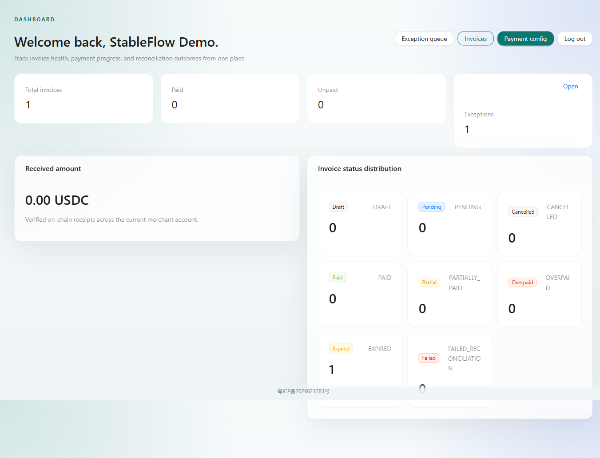
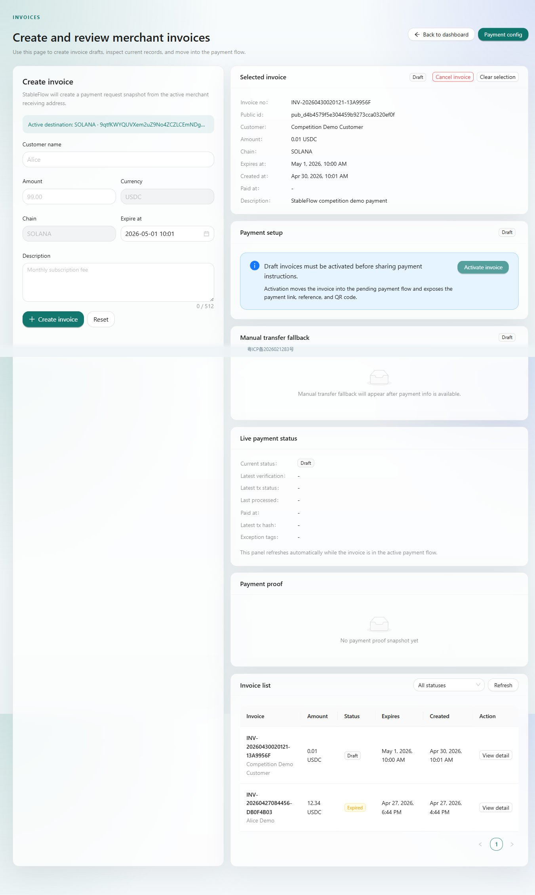
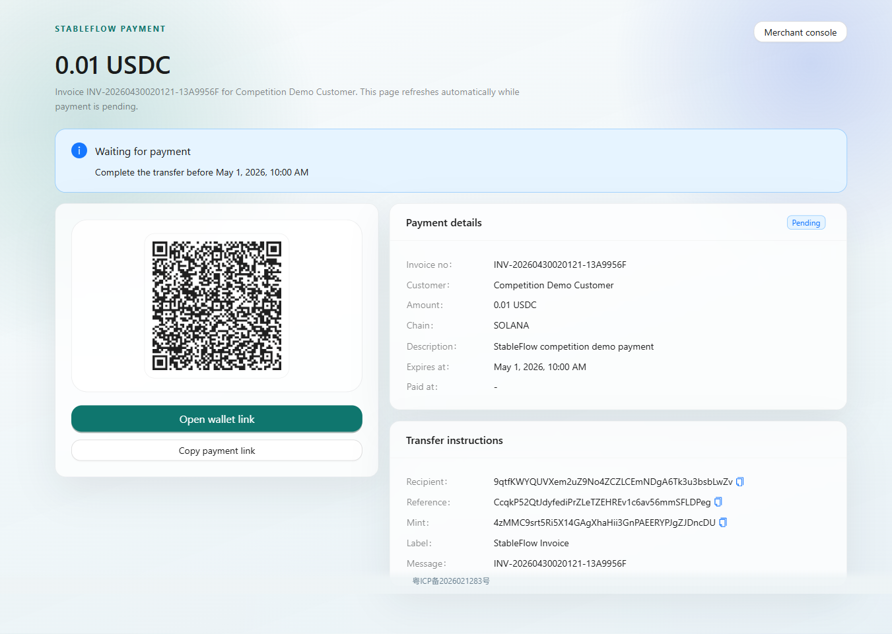

# StableFlow

[中文说明](./README.zh-CN.md) | [English](./README.md)

> A submission project for the Solana Hackathon, April 2026

StableFlow is a Solana-native stablecoin billing, payment verification, and reconciliation infrastructure for global digital merchants.

It is designed for merchants who want to manage invoice creation, payment collection, on-chain verification, reconciliation, and payment proof generation in one workflow.

## Overview

In cross-border digital payments, merchants often switch between multiple tools for quoting, invoicing, follow-up, payment confirmation, and reconciliation. StableFlow brings these steps into one system and focuses on a practical USDC payment workflow built on Solana.

The current MVP follows a clear end-to-end flow:

1. Merchant signs in
2. Merchant configures a fixed Solana receiving address
3. Merchant creates an invoice
4. StableFlow generates a unique reference and payment request
5. Customer opens the public payment page and pays
6. Backend scans on-chain transactions and verifies the payment
7. The invoice is reconciled automatically and a payment proof is generated
8. Merchant tracks status and summary data in the dashboard

The core attribution model is:

**Fixed receiving address + reference**

This allows StableFlow to deliver a stable invoice attribution and reconciliation loop in the hackathon and MVP stage.

## What Problem It Solves

- Stablecoin collection workflows are fragmented and manual
- Merchants lack a standard invoice-centered payment verification process
- Order attribution and reconciliation still require manual work after on-chain settlement
- Teams need a traceable payment result and proof for both merchant operations and customer communication

StableFlow is not a wallet or an exchange. It is merchant-facing payment workflow infrastructure.

## Core Capabilities

- Merchant sign-in and invoice management
- Fixed Solana receiving address configuration
- Invoice creation, activation, and public payment page generation
- Solana-native payment information display, including amount, recipient, reference, and mint
- On-chain transaction scanning and payment verification
- Automatic reconciliation and payment status updates
- Payment proof generation and display
- Dashboard summary for paid, pending, and exceptional invoices
- Agent capability as an enhancement layer built on verified invoice and payment facts

## Demo

- Live demo: [http://110.40.155.140/](http://110.40.155.140/)
- Demo guide: [docs/demo-operation-guide.md](docs/demo-operation-guide.md)
- Deployment guide: [docs/deployment.md](docs/deployment.md)
- Public payment page example: [http://110.40.155.140/pay/pub_d4b4579f5e304459b9273cca0320ef0f](http://110.40.155.140/pay/pub_d4b4579f5e304459b9273cca0320ef0f)
- Demo network: Solana Devnet

If you want to understand the product quickly, the fastest path is to walk through the demo flow: sign in, configure a receiving address, create an invoice, activate it, open the public payment page, and observe the payment status changes.

## Screenshots

### Dashboard



### Invoice Management



### Public Payment Page



## Product Flow

```text
Merchant configures fixed receiving address
  -> Create invoice
  -> Generate unique reference and payment request
  -> Customer opens public payment page
  -> Customer sends USDC on Solana
  -> Backend scans on-chain transaction
  -> Verify recipient / reference / token / amount / time window
  -> Reconcile invoice and generate payment proof
  -> Dashboard updates merchant-facing status
```

## Tech Stack

- Backend: Spring Boot 3, Java 21, MyBatis-Plus, Flyway
- Frontend: React 18, Vite, TypeScript, Ant Design, React Query
- Data: PostgreSQL, Redis
- Blockchain: Solana RPC, sol4k
- Deployment: Docker Compose, Nginx

## Repository Structure

- `docs/`: product, architecture, implementation, and deployment documents
- `backend/`: Spring Boot backend
- `frontend/`: React frontend

## Quick Start

If you want to run the current version, the recommended entry point is:

- [docs/deployment.md](docs/deployment.md)

The current recommended deployment setup is a single-machine Docker Compose stack, with frontend and backend deployed together and PostgreSQL, Redis, and Solana RPC provided externally.

## Further Reading

- [docs/requirements.md](docs/requirements.md)
- [docs/technical-design.md](docs/technical-design.md)
- [docs/implementation-guide.md](docs/implementation-guide.md)
- [docs/dev-tasks.md](docs/dev-tasks.md)

## Positioning

StableFlow is not a wallet, not an exchange, and not just a chatbot.

It is a merchant-facing stablecoin payment workflow infrastructure layer that connects:

- Invoicing
- Payment request generation
- On-chain payment detection
- Order attribution
- Automatic reconciliation
- Payment proof
- Basic operational and reconciliation summaries
