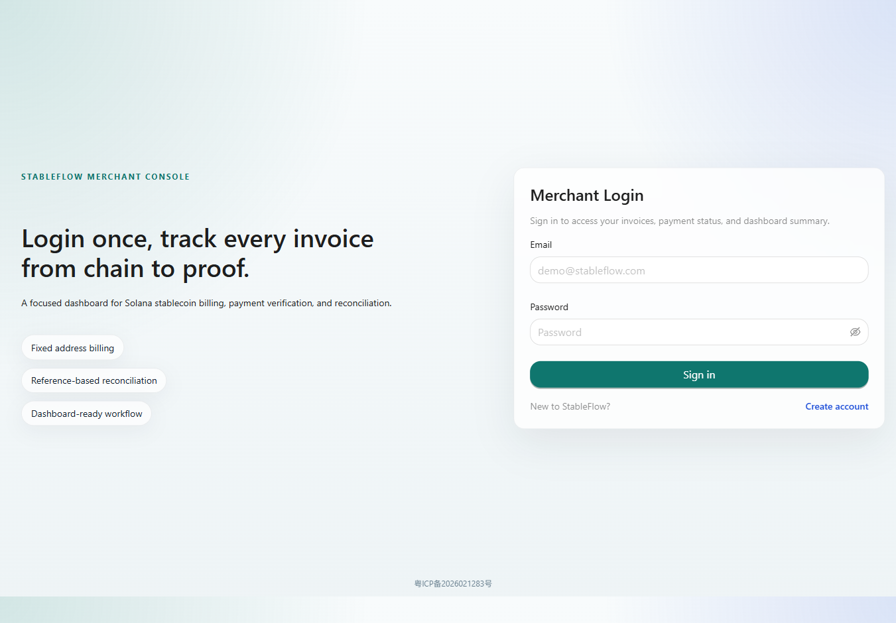
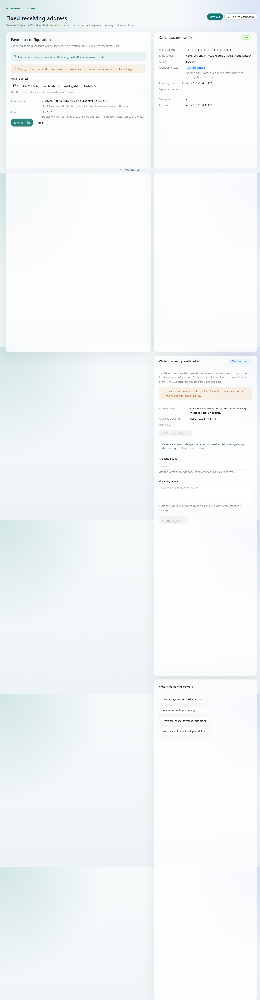
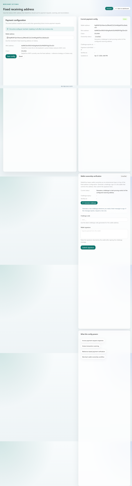
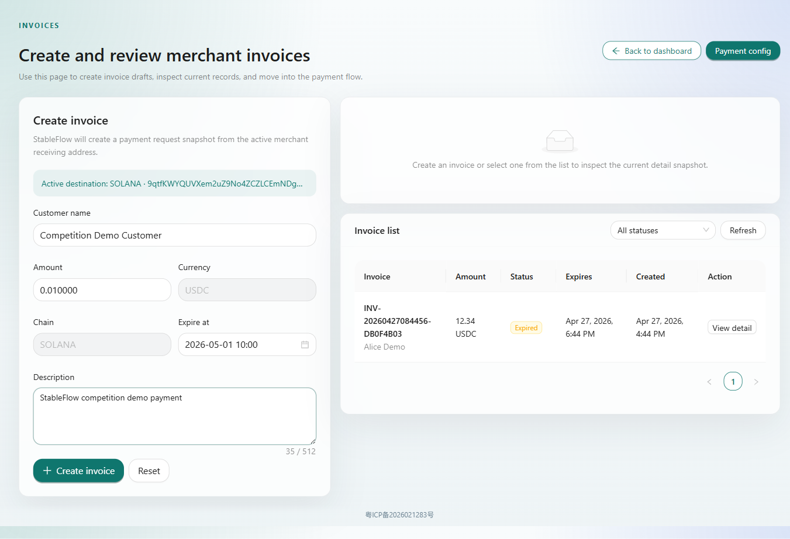
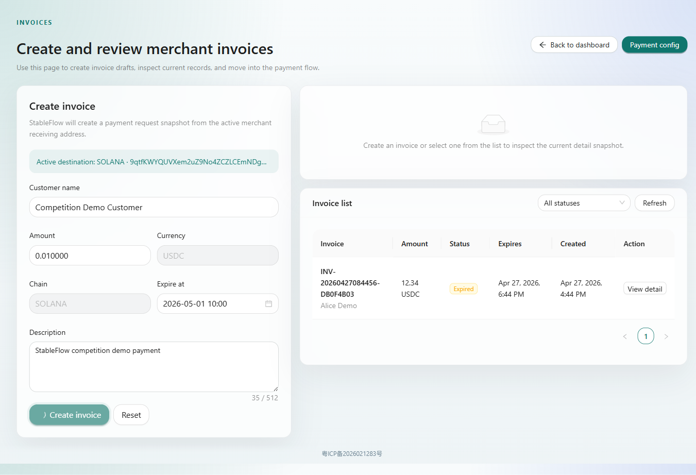
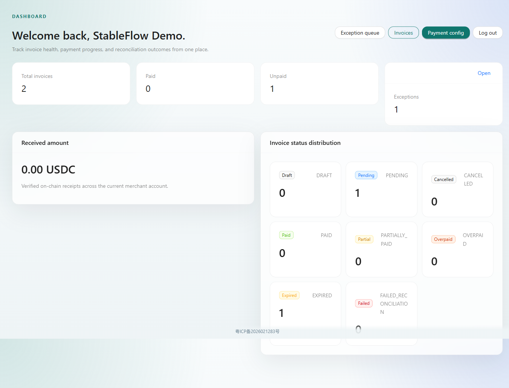

# StableFlow 演示操作说明

## 1. 文档说明

本文档用于说明 StableFlow 当前 Demo 环境的主要操作流程。

演示环境：

- 访问地址：`http://110.40.155.140/`
- 登录账号：`demo_20260427164445@stableflow.test`
- 演示网络：Solana Devnet
- 演示目标：完成从商户配置收款地址、创建账单、生成公共支付页，到等待链上付款确认的主流程。

当前已经生成一张待支付演示账单：

- 账单号：`INV-20260430020121-13A9956F`
- 金额：`0.01 USDC`
- 公共支付页：`http://110.40.155.140/pay/pub_d4b4579f5e304459b9273cca0320ef0f`
- 收款地址：`9qtfKWYQUVXem2uZ9No4ZCZLCEmNDgA6Tk3u3bsbLwZv`
- Reference：`CcqkP52QtJdyfediPrZLeTZEHREv1c6av56mmSFLDPeg`
- USDC Mint：`4zMMC9srt5Ri5X14GAgXhaHii3GnPAEERYPJgZJDncDU`

---

## 2. 登录系统

打开演示地址后，系统会进入商户登录页。



输入演示账号和密码后，点击 `Sign in` 进入商户后台。

---

## 3. 查看仪表盘

登录成功后进入 Dashboard。这里可以查看账单总数、已支付数量、未支付数量、异常数量和账单状态分布。


Dashboard 适合在演示开场时说明 StableFlow 的定位：商户可以从一个后台集中查看账单、支付状态和对账结果。

---

## 4. 配置商户收款地址

点击顶部的 `Payment config`，进入收款地址配置页。

本次演示使用的 Solana 收款地址为：
  
```text
9qtfKWYQUVXem2uZ9No4ZCZLCEmNDgA6Tk3u3bsbLwZv
```

填写地址后点击 `Save config` 保存。



配置完成后，后续新建账单都会基于该地址生成支付请求。已创建过的账单不会被新的配置反向修改。

---

## 5. 进入账单页面

点击顶部的 `Invoices`，进入账单管理页。

该页面左侧用于创建新账单，右侧用于查看已创建账单和当前选中账单详情。



---

## 6. 创建账单

在创建账单表单中填写：

- Customer name：`Competition Demo Customer`
- Amount：`0.01`
- Currency：`USDC`
- Chain：`SOLANA`
- Description：`StableFlow competition demo payment`

填写完成后点击 `Create invoice`。



创建成功后，系统会生成账单号、公共 ID、金额、过期时间和描述等信息。



---

## 7. 激活账单

新建账单默认是 Draft 状态，需要点击 `Activate invoice` 才能进入待支付流程。

激活后，系统会生成：

- 公共支付页链接
- 收款地址
- Reference
- QR Code
- 实时支付状态


本次演示账单信息：

```text
Invoice no: INV-20260430020121-13A9956F
Public payment page: http://110.40.155.140/pay/pub_d4b4579f5e304459b9273cca0320ef0f
Amount: 0.01 USDC
Status: Pending
```

---

## 8. 打开公共支付页

打开公共支付页：

```text
http://110.40.155.140/pay/pub_d4b4579f5e304459b9273cca0320ef0f
```

支付页会展示付款人需要的信息，包括金额、收款地址、Reference、Mint、Label 和 Message。


转账时需要注意：

- 网络使用 Solana Devnet
- 代币使用 Devnet USDC
- 收款地址必须填写支付页中的 Recipient
- Reference 必须随交易一起带上
- 金额为 `0.01 USDC`

StableFlow 的当前归因策略是 `固定收款地址 + Reference`。系统会通过链上交易中的 Reference 将付款归属到对应账单。

---

## 9. 查看状态变化

账单激活后，Dashboard 中可以看到未支付账单数量变为 `1`，状态分布中 `PENDING` 数量变为 `1`。



完成真实转账后，后台扫描任务会通过 Solana RPC 读取链上交易，并尝试完成：

1. 识别交易是否支付到商户固定地址
2. 检查交易 Reference 是否匹配账单
3. 校验金额和币种
4. 更新账单支付状态
5. 生成支付证明
6. 更新 Dashboard 统计

---

## 10. 演示讲解建议

演示时可以按下面顺序讲：

1. StableFlow 面向稳定币收款商户，解决账单、链上付款验证和对账问题。
2. 商户先配置一个固定 Solana 收款地址。
3. 创建账单时，系统生成带 Reference 的支付请求。
4. 客户打开公共支付页完成转账。
5. 后台扫链任务识别付款并核销账单。
6. 商户在 Dashboard 查看支付状态、异常和对账结果。

如果时间有限，重点展示 `Payment config`、`Create invoice`、`Public payment page` 和 `Dashboard` 四个页面即可。
